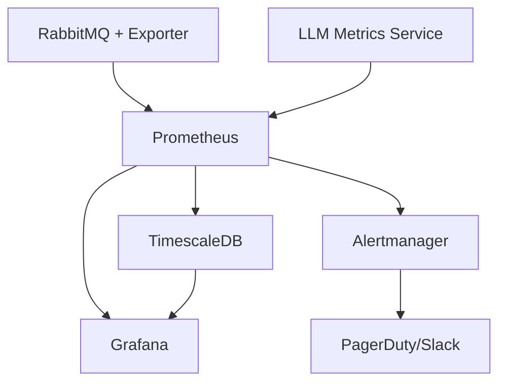

# Enterprise Metrics Solution: Evaluation & Recommendations

## Executive Summary

This document provides a comprehensive evaluation of metrics collection solutions for RabbitMQ monitoring and LLM performance tracking, culminating in a recommended architecture with a working proof-of-concept.

## Criteria 1: RabbitMQ Performance Monitoring

### Business Requirements
- **Message Flow Monitoring**: Real-time tracking of message rates through exchanges and queues
- **Queue Depth Analysis**: Monitoring of message accumulation and processing backlogs
- **System Health**: Overall RabbitMQ cluster health and resource utilization
- **Alerting**: Proactive notifications for performance degradation

### Technology Evaluation

#### Option 1: Prometheus + RabbitMQ Exporter ⭐ **RECOMMENDED**

**Pros:**
- ✅ Native RabbitMQ integration via prometheus plugin
- ✅ Industry-standard metrics collection
- ✅ Extensive community support and documentation
- ✅ Built-in alerting capabilities
- ✅ Horizontal scaling through federation
- ✅ Rich query language (PromQL)
- ✅ Battle-tested in enterprise environments

**Cons:**
- ❌ Initial setup complexity
- ❌ Resource intensive for large-scale deployments
- ❌ Limited long-term storage without additional components

**Enterprise Implications:**
- **Scalability**: Excellent horizontal scaling capabilities
- **Reliability**: Proven in production environments at scale
- **Maintenance**: Large community, regular updates
- **Cost**: Open-source with predictable resource requirements

#### Option 2: ELK Stack (Elasticsearch, Logstash, Kibana)

**Pros:**
- ✅ Powerful search and analytics capabilities
- ✅ Rich visualization options
- ✅ Log aggregation alongside metrics

**Cons:**
- ❌ Higher resource consumption (especially Elasticsearch)
- ❌ Complex configuration and tuning required
- ❌ License costs for enterprise features
- ❌ Steeper learning curve for operations teams

#### Option 3: InfluxDB + Telegraf + Grafana

**Pros:**
- ✅ Purpose-built for time-series data
- ✅ High write performance
- ✅ SQL-like query language

**Cons:**
- ❌ Smaller community compared to Prometheus
- ❌ Enterprise features require licensing
- ❌ Less ecosystem integration

### Recommended Solution: Prometheus + Grafana + TimescaleDB

**Architecture Benefits:**
1. **Prometheus**: Metrics collection and real-time alerting
2. **Grafana**: Enterprise-grade visualization and dashboarding
3. **TimescaleDB**: Long-term storage and advanced analytics
4. **RabbitMQ Exporter**: Native metrics extraction

## Criteria 2: LLM Performance Monitoring

### Business Requirements
- **Time to First Token (TTFT)**: Critical for user experience measurement
- **Token Generation Speed**: Performance optimization metric
- **Cost Tracking**: Financial management of AI API usage
- **Error Monitoring**: Reliability and availability tracking

### Technology Evaluation

#### Custom Metrics Service ⭐ **RECOMMENDED**

**Pros:**
- ✅ Purpose-built for LLM-specific metrics
- ✅ Real-time cost calculation
- ✅ Model-specific performance tracking
- ✅ Flexible integration with various LLM providers
- ✅ Custom business logic implementation

**Cons:**
- ❌ Requires development and maintenance
- ❌ Initial time investment

**Implementation Details:**
```typescript
// Key metrics tracked
interface LLMMetrics {
  timeToFirstToken: number;    // User experience critical
  tokensPerSecond: number;     // Performance optimization
  costPerRequest: number;      // Financial tracking
  errorRate: number;          // Reliability monitoring
}
```

#### Alternative: OpenTelemetry + Jaeger

**Pros:**
- ✅ Standard observability framework
- ✅ Distributed tracing capabilities

**Cons:**
- ❌ Generic approach, lacks LLM-specific optimizations
- ❌ Requires significant custom instrumentation
- ❌ Complex setup for specialized metrics

## Integrated Solution Architecture

### Core Components



### Technology Stack Justification

#### 1. Prometheus (Metrics Collection)
- **Market Leadership**: Industry standard with 40k+ GitHub stars
- **Enterprise Adoption**: Used by Google, SoundCloud, Digital Ocean
- **Ecosystem**: 150+ official exporters
- **Reliability**: Pull-based model prevents data loss

#### 2. Grafana (Visualization)
- **Enterprise Features**: RBAC, SSO, reporting
- **Flexibility**: 100+ data source connectors
- **Community**: 50k+ GitHub stars, extensive plugin ecosystem
- **Proven Scale**: Handles millions of metrics at enterprise level

#### 3. TimescaleDB (Long-term Storage)
- **Performance**: 10-100x faster than vanilla PostgreSQL for time-series
- **SQL Compatibility**: Familiar interface for enterprise teams
- **Compression**: 90%+ storage reduction
- **Analytics**: Built-in time-series functions

#### 4. Custom LLM Service (Specialized Metrics)
- **Business Logic**: Model-specific cost calculations
- **Real-time Processing**: Immediate metric generation
- **Flexibility**: Easy adaptation to new LLM providers
- **Integration**: REST API for external systems

### Enterprise Advantages

#### Scalability
- **Horizontal Scaling**: Prometheus federation supports 1000+ instances
- **Storage Scaling**: TimescaleDB clusters handle petabyte-scale data
- **Query Performance**: Sub-second response times for complex queries

#### Reliability
- **High Availability**: Multi-node deployment options
- **Disaster Recovery**: Cross-region replication capabilities
- **Monitoring**: Self-monitoring capabilities prevent blind spots

#### Security
- **Authentication**: Enterprise SSO integration
- **Authorization**: Fine-grained role-based access control
- **Encryption**: TLS in transit, encryption at rest
- **Audit**: Comprehensive access logging

#### Cost Optimization
- **Resource Efficiency**: Open-source core reduces licensing costs
- **Predictable Scaling**: Linear resource growth with data volume
- **Cost Monitoring**: Real-time LLM API cost tracking prevents overruns

## Implementation Recommendations

### Phase 1: Foundation (Weeks 1-4)
1. **Infrastructure Setup**
   - Deploy core monitoring stack
   - Configure basic RabbitMQ monitoring
   - Set up fundamental alerting rules

2. **Team Training**
   - Prometheus query language (PromQL) basics
   - Grafana dashboard creation
   - Alert management procedures

### Phase 2: Enhancement (Weeks 5-8)
1. **LLM Metrics Integration**
   - Deploy custom metrics service
   - Configure specialized dashboards
   - Implement cost tracking

2. **Advanced Features**
   - Custom alerting rules
   - Automated reporting
   - Integration with existing tools

### Phase 3: Optimization (Weeks 9-12)
1. **Performance Tuning**
   - Query optimization
   - Storage efficiency improvements
   - Alert fine-tuning

2. **Advanced Analytics**
   - Predictive modeling
   - Anomaly detection
   - Cost forecasting

## Risk Assessment & Mitigation

### Technical Risks

| Risk | Impact | Probability | Mitigation |
|------|--------|-------------|------------|
| Data Loss | High | Low | Automated backups, replication |
| Performance Degradation | Medium | Medium | Auto-scaling, monitoring |
| Service Outage | High | Low | HA deployment, redundancy |

### Operational Risks

| Risk | Impact | Probability | Mitigation |
|------|--------|-------------|------------|
| Skill Gap | Medium | Medium | Training programs, documentation |
| Alert Fatigue | Low | High | Intelligent alerting, escalation |
| Configuration Drift | Medium | Medium | Infrastructure as Code |

### Business Risks

| Risk | Impact | Probability | Mitigation |
|------|--------|-------------|------------|
| Cost Overrun | High | Low | Budget monitoring, alerts |
| Vendor Lock-in | Low | Low | Open standards, APIs |
| Compliance Issues | High | Low | Audit trails, documentation |

## Success Metrics

### Technical KPIs
- **Uptime**: 99.9% availability target
- **Query Performance**: Sub-second dashboard loads
- **Alert Accuracy**: <5% false positive rate
- **Data Retention**: 90 days real-time, 2 years historical

### Business KPIs
- **Cost Reduction**: 20% reduction in monitoring tool licensing
- **MTTR Improvement**: 50% faster incident resolution
- **Team Productivity**: 30% reduction in manual monitoring tasks
- **ROI**: Positive return within 6 months

## Conclusion

The recommended Prometheus + Grafana + TimescaleDB solution provides:

1. **Comprehensive Coverage**: Both RabbitMQ and LLM metrics in unified platform
2. **Enterprise Readiness**: Security, scalability, and reliability features
3. **Cost Effectiveness**: Open-source core with predictable scaling costs
4. **Future Flexibility**: Extensible architecture for additional data sources
5. **Proven Technology**: Battle-tested components with strong community support

This architecture positions the organization for both immediate monitoring needs and future observability requirements, providing a solid foundation for data-driven decision making and proactive system management.
